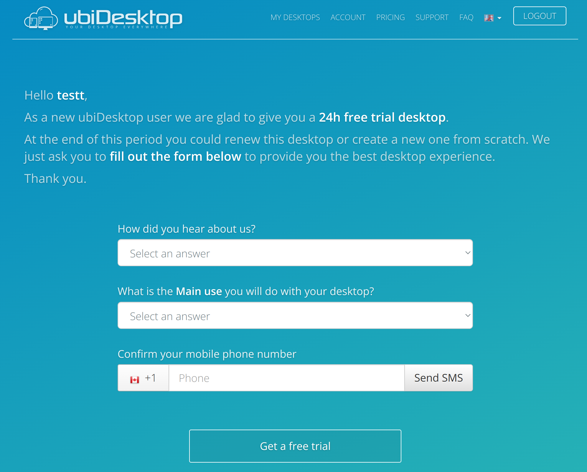

# WoCC'23 Tutorial <br> Virt+GitHub
##### December 13 - Polytechnic School of Yaounde, Cameroon
*Stella Bitchebe*

# ubiDesktop

[ubiDesktop](https://www.ubidesktop.com/) is a cloud VM provider that offers a 24 hour free tier service without the need for a credit card.
After the first 24 hours, you will need to fill out your billing informations to continue using the cloud service.

### Creating an Account

On the home page, click on the "*TRY IT FOR FREE*" button to create a free account.


<br> <br>

You will be directed to the sign up page where you will fill your name, email address, and password.


You will then receive an email at the address you have entered: clik on the link in that email to verify your address.
Once your email address is verified, you can then login and access your workspace.

### Creating a VM

At your first login, click on "*GET A FREE TRIAL*".


Answer all the questions on the following page and click on the *Get a free trial* button below.

<p align="center">

</p>

Fill in a valid phone number to which you have access since a verification code will be send to verify you are not a bot.

On the next page, you will be asked to choose a name for your VM, a password, and the operating system -OS- (**Ubuntu 22.04** in our case).

<p align="center">

</p>

After filling out all required information, click on *Create desktop* to finish VM's creation.

### Starting and Accessing the VM

1. On the next page, you have your VM settings interface. Click on *POWER ON* to start the just-created VM.

<p align="center">

</p>

2. The OS installing and VM launch will take a few minutes: wait until it starts and then click on *GET ACCESS*.

<p align="center">

</p>

3. The following pop-up windows will be displays showing the connection instructions.
<p align="center">

</p>

4. On your laptop, you will need to the *client support* corresponding to your OS (Windows/Ubuntu)
<p align="center">

</p>

5. After installing the client support, go back to step 2 of the previous pop-up and download the `nxs` connection file for your VM.*
<p align="center">

</p>

6. Now open the `NoMAchine` desktop app you previously installed (the NX client support), and click on *Machines* and then *New*.
<p align="center">

</p>

7. On the following page, at the bottom, click on *Upload a configuration file* and select the `nxs` file you downloaded on **5**.
<p align="center">

</p>

The list of all you VMs will be displayed on the *Machines*'s home page like this:
<p align="center">

</p>

8. Double click on your VM in the list and login as **administrator** with the password you filled in during the VM creation.
<p align="center">

</p>

If you forgot the password, it is recalled in step 3 of the instruction's list in **3**.
<p align="center">

</p>

Finally, you can enjoy your free cloud VM!
<p align="center">

</p>

# GitHub   
GitHub is a cloud-based Git (a version control system) repository that helps you store, manage, track and control changes to your projects.

### Installation
1. On Linux:
   ```
   sudo apt update
   sudo apt install git-all
   ```
   
2. On Windows: 
   
   * Download the [windows installer](https://github.com/git-for-windows/git/releases/download/v2.39.0.windows.1/Git-2.39.0-64-bit.exe) that we make available [here](resources/Git-2.39.0-64-bit.exe)
   
   * At the 'PATH environment' installation phase, choose *Git from the command line and also from 3rd party software* ==> this will provide a git bash terminal that understands all git commands. 

### Account Creation

Creating a GitHub account is simple. Just [sign up](https://github.com/signup?ref_cta=Sign+up&ref_loc=header+logged+out&ref_page=%2F&source=header-home) and follow the steps (enter a valid and accessible email address, a user name, and a password).

# GitHub
1. Create a new repository in your GitHub account (by clicking on `new` like in the following picture):

    Fill in the name and the description and click on `Create repository` at the bottom of the page: you will be provided with a list of commands to link your local *code/project* to the newly created repo.
<br>

2. On your laptop, choose a project that you would like to save in the cloud, move to the corresponding directory, and type:
    ```
    echo "# xxxx" >> README.md
    git init
    git add README.md
    git commit -m "first commit"
    git branch -M main
    git remote add origin git@github.com:xxxx (the link of your repo)
    git push -u origin main
    ```
    At the end, reload your git page and your project should be available.
<br>

3. Now, move back to your AWS' VM to clone your repo.
   Before cloning, you must establish the ssh connection with your laptop and your VM. Click on the profile's button at the top right and go to `settings` -> `ssh and GPG keys` -> `new SSH key`. Give a name to your key and enter the public key of your device. 
   Open a terminal (on Linux or the Git bash terminal on Windows) and first generate an ssh key (if you don't yet have one): `ssh-keygen`. 
   > You can leave all the answer's fields blank, and at the end, the tool will print the path to your public key (generally at `$HOME/.ssh/id_rsa.pub`)
   
   Once your keys are generated, print the public one: `cat path/to/your/id_rsa.pub` and copy it to your GitHub account settings.

   You can now clone your repo both in your VM and your laptop. Copy the link as in the picture below, and in a terminal, type: `git clone git@githubxxxxxx`.

   

4. In your VM, make some changes to your project and upload them:
   ```
   git status (to know which files have been modified and need to be saved)
   git add xxx (xxx is for the files you want to save; you can replace xxx by '.' to include everything)
   git commit -m "a message that informs about the backup"
   git push (to upload the files to save)
   ```
   If you refresh the GitHub page, you can see your changes.
<br>

5. Now, go to your laptop and browse your files: obviously, you still have the previous version of your project, i.e., the changes made from your VM are not visible on your laptop. To have the same version as your VM (and the remote one), you need to `pull` the changes: `git pull`.
<br>

6. Let us simulate a failure i.e., you *accidentally* delete your directory in one or both machines (your VM or your laptop). If you do so, recovery is as simple as just re-cloning the project, like in [step 3](https://github.com/bstellaceleste/ScientificDaysCameroon/blob/main/tutorials/README.md?plain=1#L75).
<br>

7. Let us now imagine that you pushed something you didn't want to. Don't panic! You can revert to the previous commit like this: `git reset --soft HEAD~`. This will move your project (remote) to the version before the unfortunate commit.
    > A '**--hard**' reset will also move your local files to the previous version. 

    
