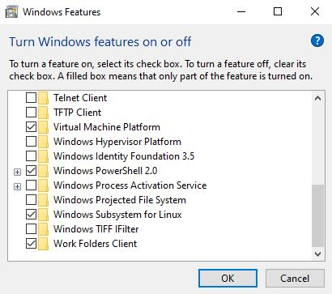
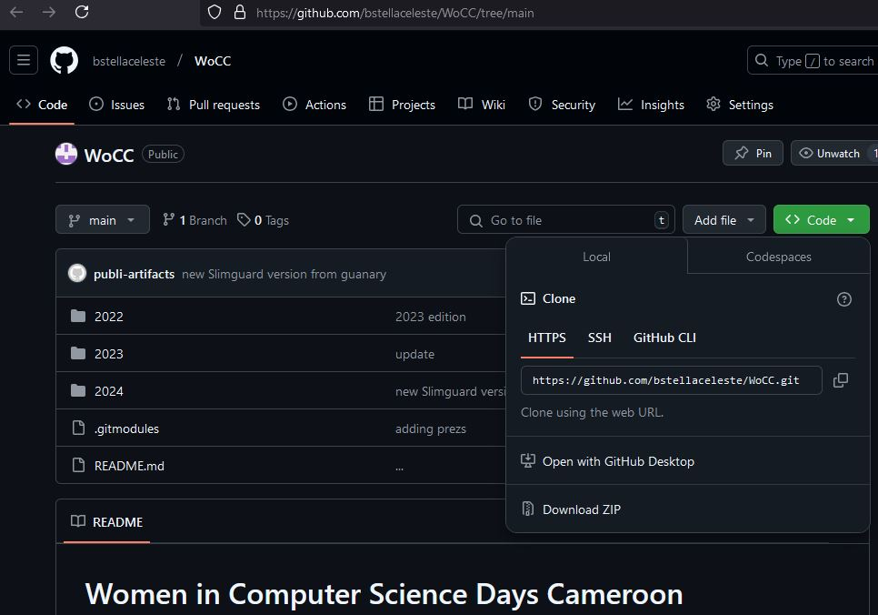
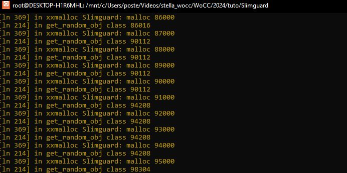

# WoCC'24 Tutorial <br> [Slimguard Secure Allocator](https://github.com/ssrg-vt/SlimGuard) and [Parsec Benchmark](https://arco.e.ac.upc.edu/wiki/images/8/8a/Seminar_Parsec3.pdf)

##### December 17, 2024 - Polytechnic School of Yaounde, Cameroon
*Stella Bitchebe*

In this tutorial, we will see how to use a secure allocator, by dynamically linking it with a C program. When dynamically linking the allocator library to the program, the dynamic linker will replace calls to malloc by the secure allocator's implementation of malloc during the program execution.

[SlimGuard](https://www.ssrg.ece.vt.edu/papers/middleware19-slimguard.pdf) is a secure dynamic memory allocator whose design is driven by memory efficiency.

We will need a Linux-based (e.g., Ubuntu) environment to use Slimguard.
So the first thing is installing WSL (Windows Subsystem for Linux) for those using Windows.

## Installing WSL and Ubuntu 20.04 on Windows

1. First, verify that the _windows sybsystem for linux_ feature is enable (you wll probably need to reboot your computer to apply changes if it was not enabled)


<br>

2. Now follow this [link](https://learn.microsoft.com/en-us/windows/wsl/install) for commands to use wsl. 

You can also simply try to open **Microsoft Store** and download it from there (if available).

Once installed you will be asked to define a username and a password.

## Downloading, Compiling, and using Slimguard

1. Download the WoCC24's tutorial repository: 
   ```
   git clone https://github.com/bstellaceleste/WoCC.git
   ```
   You can also directly download the zip from my [Github](https://github.com/bstellaceleste/WoCC/tree/main)
   
   <br>

2. Move to the tutorial folder: `cd 2024/tuto/Slimguard`

3. Compile Slimguard:
   1. *first install prerequisites*: 
        > sudo apt install -y make build-essential gcc g++
   2. *enable overcommitment*:
        > sudo sysctl vm.overcommit_memory=1
   3. *then compile*:
        > make

4. Test Slimguard: 
   1. write a simple C program that uses malloc and execute it by dynamically linking the Slimguard allocator to it (you can copy and paste the following example to a test-malloc.c file):
        > #include <stdlib.h>
        > #include <stdio.h> 
        > int main()
        > {
        > for (int i=1; i<100; i++) 
        > {
        >  int *p = (int *)malloc(i*1000);  
        >  p[0] = i; 
        > }
        > return 0;
        > }
   2. compile it: `gcc -o test-malloc test-malloc.c`
   3. execute it using the Slimguard allocator: 
        > LD_PRELOAD=/path/to/tutorial-folder/Slimguard/libSlimGuard.so ./test-malloc
    
        The test is successful if you see the following logs:
        
        You can modify the output of the log in the function `xxmalloc()` in file `Slimguard/src/simguard.c`.
        <br>
        > N.B.: you notice that a `Debug` funtion is used to print out the log; this is because we ***never use the native c `print` funtion inside an allocator*** (because `print` also makes call to malloc).
    
## Using the Parsec Benchmak
Benchmarking a computer system is running a standard program/set of programs (the benchmark(s)) on it in order to measure its performance.

In the WoCC folder, you have a `parsec-benchmark` folder. Move to that folder and do the following:

- install prerequisites: `./configure`
- in the `/bin` directory, you have the `parsecmgmt` binary that we will use

The Parsec benchmark suite has multiples applications, but in this tutorial we will focus on 4 applications: `blackscholes, fluidanimate, freqmine, and facesim`.

The following steps show how to build and run each parsec application using Slimguard:
- bin/parsecmgmt -a build -p blackscholes
- LD_PRELOAD=/path/to/WoCC/2024/tuto/Slimguard/libSlimGuard.so bin/parsecmgmt -a run -p blackscholes
